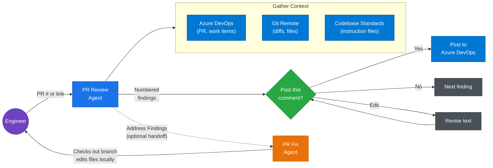

# Azure DevOps GitHub Copilot Pull Request Review

> **This project fills a gap.** GitHub Copilot's built-in [Code Review Agent](https://docs.github.com/en/copilot/how-tos/use-copilot-agents/request-a-code-review/use-code-review) only works with GitHub-hosted repositories. If your repo is on [Azure DevOps](https://learn.microsoft.com/en-us/azure/devops/user-guide/what-is-azure-devops?view=azure-devops), you can't use it. This project bridges that gap by wiring together three things Microsoft already built: [GitHub Copilot](https://docs.github.com/en/copilot/get-started/what-is-github-copilot), [GitHub Copilot Custom Agents in VS Code](https://code.visualstudio.com/docs/copilot/customization/custom-agents), and the [Azure DevOps MCP Server](https://github.com/microsoft/azure-devops-mcp). All three are Microsoft products that just don't integrate with each other natively yet. The entire setup is a Markdown file that reads your codebase and generates ready-to-go agents (more markdown files). No code, no infrastructure, no dependencies beyond what you already have. **If your repo is on GitHub, skip all of this and use the built-in Code Review Agent instead.**

A GitHub Copilot [custom agent](https://code.visualstudio.com/docs/copilot/customization/custom-agents) that reviews Azure DevOps PRs from inside VS Code. Posts inline comments with individual approval, enforces your team's coding standards, and optionally implements the suggested fixes on the PR branch.



## Prerequisites

- [VS Code 1.106+](https://code.visualstudio.com/download) with [GitHub Copilot](https://docs.github.com/en/copilot) (free tier works). Custom agents were [introduced in VS Code 1.106](https://code.visualstudio.com/updates/v1_106).
- [Git](https://git-scm.com/downloads) - The agent runs git commands for all diff and context-gathering operations.
- [Node.js 20+](https://nodejs.org/en/download) - The [Azure DevOps MCP Server](https://github.com/microsoft/azure-devops-mcp) runs via [npx](https://docs.npmjs.com/cli/v11/commands/npx).
- Access to your Azure DevOps organization. The MCP server authenticates via [OAuth](https://oauth.net/) by default (a browser window opens on first use prompting you to sign in with your Microsoft account). If OAuth is blocked by your organization's tenant policies, see the [Azure DevOps MCP Server auth docs](https://github.com/microsoft/azure-devops-mcp/blob/main/docs/TROUBLESHOOTING.md) for Azure CLI and environment variable alternatives.

## Quick Start

There is a [prompt file](https://code.visualstudio.com/docs/copilot/customization/prompt-files) that analyzes your codebase and generates every file the PR Review Agent needs. Its design follows the same patterns as GitHub Copilot's built-in [`/init` command](https://github.com/microsoft/vscode-copilot-chat/blob/main/assets/prompts/init.prompt.md).

1. Download [`create-pr-review-agent.prompt.md`](create-pr-review-agent.prompt.md) and place it in your repo at `.github/prompts/create-pr-review-agent.prompt.md`. The file name and path must be exact.
2. Open VS Code, open GitHub Copilot chat, type `/createPrReviewAgent`.
3. Confirm the auto-detected ADO organization, project, repository name, and base URL (or provide corrections). Enter your default branch.
4. Review the generated files, especially `.github/instructions/code-review.instructions.md` (the AI's best guess at your team's standards - edit as needed).
5. Commit and push. Then follow the [**Starting the MCP Server**](#starting-the-mcp-server) steps below before using the agent.

This generates six files (or merges into them if they already exist):

| File | Purpose |
|------|---------|
| `.github/agents/pr-review.agent.md` | Custom agent |
| `.github/agents/pr-fix.agent.md` | Companion agent for implementing fixes (hidden from dropdown) |
| `.github/instructions/code-review.instructions.md` | Review standards, generated from your codebase |
| `.github/prompts/pr-review.prompt.md` | `/prReview` slash command |
| `.vscode/mcp.json` | Azure DevOps MCP server configuration |
| `.github/copilot-instructions.md` | Global GitHub Copilot context (created or updated) |

## Starting the MCP Server

**THE PR REVIEW AGENT WILL NOT WORK UNTIL YOU DO THIS.**

1. **Start the server.** Open `.vscode/mcp.json` and click **Start** on the code lens that appears above the `ado` server entry. VS Code will prompt you to trust the server on first launch - accept it. Alternatively, run **MCP: List Servers** from the Command Palette (`Ctrl+Shift+P` / `Cmd+Shift+P`) and start `ado` from there.
2. **Reload the VS Code window.** Press `Ctrl+Shift+P` (or `Cmd+Shift+P` on macOS), select **Developer: Reload Window**. This clears stale MCP configuration cache and ensures VS Code detects the server. You should do this after the initial setup and whenever the MCP server is not being recognized.

If the server still does not start or the agent cannot find ADO tools, see the [Azure DevOps MCP Server Troubleshooting](https://github.com/microsoft/azure-devops-mcp/blob/main/docs/TROUBLESHOOTING.md) guide and VS Code's [MCP Server Troubleshooting](https://code.visualstudio.com/docs/copilot/customization/mcp-servers#_troubleshoot-and-debug-mcp-servers) docs.

## Using the Agent

**Option A**: In GitHub Copilot chat, click the agent dropdown and select "PR Review", type a PR number or paste a PR link.

**Option B**: Type `/prReview` in the chat panel. It asks for the PR number and an optional focus area.

The agent fetches the remote diff, reads surrounding context, reviews against your standards, presents findings grouped by severity, and walks you through each comment one at a time before posting to Azure DevOps.

## Manual Setup

If you prefer to set things up by hand, see the [`example/`](example/) folder for a complete working reference (Node.js/TypeScript).

1. **Copy the file structure** from `example/` into your repo.
2. **Update the agent file.** Find-and-replace the values in the Team Configuration comment block at the top (ADO org, project, repo name, default branch, base URL). Update Phase 4 categories for your tech stack.
3. **Update `.vscode/mcp.json`** with your ADO org name.
4. **Write your review standards** in `.github/instructions/code-review.instructions.md`. Add more files to `.github/instructions/` as needed - the agent reads every file in that folder.
5. **Commit and push.**

The `pr-fix.agent.md` file works out of the box - the only team-specific value is the default branch name in its Team Configuration comment.

---

## What's in the Box

The setup is six files. Each one maps to a VS Code or GitHub Copilot feature:

| File | What It Is | Docs |
|------|-----------|------|
| `.github/agents/pr-review.agent.md` | The main agent. Reviews PRs using the MCP server, git diffs, and your instruction files. | [Custom Agents](https://code.visualstudio.com/docs/copilot/customization/custom-agents) |
| `.github/agents/pr-fix.agent.md` | Optional companion. After a review, checks out the PR branch and implements the suggested fixes. Hidden from the dropdown. | [Handoffs](https://code.visualstudio.com/docs/copilot/customization/custom-agents#_handoffs) |
| `.github/instructions/` | Your team's coding standards and review rules. The agent reads every file in this folder. | [Custom Instructions](https://code.visualstudio.com/docs/copilot/customization/custom-instructions) |
| `.github/prompts/pr-review.prompt.md` | Adds a `/prReview` slash command to Copilot chat. Optional. | [Prompt Files](https://code.visualstudio.com/docs/copilot/customization/prompt-files) |
| `.vscode/mcp.json` | Connects GitHub Copilot to Azure DevOps so the agent can read PRs and post comments. | [MCP Servers](https://code.visualstudio.com/docs/copilot/customization/mcp-servers) |
| `.github/copilot-instructions.md` | General context about the repo that all Copilot interactions (not just PR reviews) can use. | [Global Instructions](https://code.visualstudio.com/docs/copilot/customization/custom-instructions#_use-a-githubcopilotinstructionsmd-file) |

See the [`example/`](example/) folder for a complete working reference.

## Customization

- **Add review standards.** Create more instruction files in `.github/instructions/`. The agent reads every file in that folder automatically.
- **Change review categories.** Edit Phase 4 in the agent file to match your tech stack.
- **Pin a model.** Add `model: ['Claude Opus 4.6']` or similar to the agent's YAML frontmatter. The scaffolding prompt does not set a model by default.

## Limitations

- **Local only.** Runs in each engineer's VS Code. No server-side automation or webhook trigger.
- **Requires Node.js 20+.** The Azure DevOps MCP server runs via npx.
- **ADO authentication.** Uses your local ADO credentials. See the [Azure DevOps MCP Server docs](https://github.com/microsoft/azure-devops-mcp) for setup.
- **Not a replacement for human review.** Assists reviewers, does not replace them. The engineer makes the final call.
- **VS Code only.** Custom agents are a VS Code feature. Does not work in Visual Studio, JetBrains, or other editors.

## Alternatives

### GitHub Copilot Code Review (GitHub Only)

GitHub's [built-in Code Review Agent](https://docs.github.com/en/copilot/how-tos/use-copilot-agents/request-a-code-review/use-code-review) is excellent but only works with GitHub-hosted repos. This project fills that gap for Azure DevOps.

### Pipeline-Based Automation

Extensions like [ado-copilot-code-review](https://github.com/little-fort/ado-copilot-code-review) run as pipeline tasks using the GitHub Copilot CLI. Trade-offs: require a PAT, post only general comments (not inline), no human-in-the-loop, no codebase context awareness.

### Community Discussion

There is a [community discussion](https://github.com/orgs/community/discussions/151205) requesting native GitHub Copilot support for Azure DevOps PR reviews.

## Repository Structure

```txt
create-pr-review-agent.prompt.md    # The scaffolding prompt (copy to your repo)
example/                            # Complete working reference (Node.js/TypeScript)
  .github/
    agents/pr-review.agent.md       # Example custom agent
    agents/pr-fix.agent.md          # Example fix agent (handoff companion)
    instructions/                   # Example review standards
      code-review.instructions.md
    prompts/pr-review.prompt.md     # Example slash command
    copilot-instructions.md         # Example workspace instructions
  .vscode/
    mcp.json                        # Example MCP server config
LICENSE                             # MIT
README.md                          # This file
```
