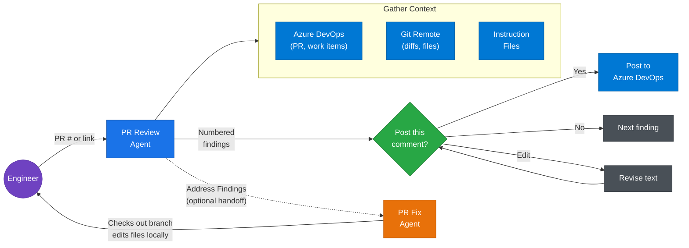

# Azure DevOps GitHub Copilot Pull Request Review

> **This project is a workaround.** GitHub Copilot already has a built-in [Code Review Agent](https://docs.github.com/en/copilot/how-tos/use-copilot-agents/request-a-code-review/use-code-review) that reviews pull requests automatically, but it only works with GitHub-hosted repositories. Microsoft will likely extend that capability to Azure DevOps Git repos at some point. Until they do, this project fills the gap. **If your repo is on GitHub, skip all of this and use the built-in Code Review Agent instead.**

A GitHub Copilot [custom agent](https://code.visualstudio.com/docs/copilot/customization/custom-agents) that reviews Azure DevOps PRs from inside VS Code. Posts inline comments with individual approval, enforces your team's coding standards, and optionally implements the suggested fixes on the PR branch.



## Prerequisites

- [VS Code 1.106+](https://code.visualstudio.com/download) with [GitHub Copilot](https://docs.github.com/en/copilot) (free tier works). Custom agents were [introduced in VS Code 1.106](https://code.visualstudio.com/updates/v1_106).
- [Git](https://git-scm.com/downloads) - The agent runs git commands for all diff and context-gathering operations.
- [Node.js 20+](https://nodejs.org/en/download) - The [Azure DevOps MCP Server](https://github.com/microsoft/azure-devops-mcp) runs via [npx](https://docs.npmjs.com/cli/v11/commands/npx).
- Access to your Azure DevOps organization. The MCP server authenticates via [OAuth](https://oauth.net/) by default (a browser window opens on first use prompting you to sign in with your Microsoft account). If OAuth is blocked by your organization's tenant policies, see the [Azure DevOps MCP Server auth docs](https://github.com/microsoft/azure-devops-mcp/blob/main/docs/TROUBLESHOOTING.md) for Azure CLI and environment variable alternatives.

## Quick Start

There is a [prompt file](https://code.visualstudio.com/docs/copilot/customization/prompt-files) that analyzes your codebase and generates every file the PR Review Agent needs. Its design follows the same patterns as GitHub Copilot's built-in [`/init` command](https://github.com/microsoft/vscode-copilot-chat/blob/main/assets/prompts/init.prompt.md).

1. Download [`create-pr-review-agent.prompt.md`](create-pr-review-agent.prompt.md) and place it in your repo at `.github/prompts/create-pr-review-agent.prompt.md`. The file name and path must be exact.
2. Open VS Code, open GitHub Copilot chat, type `/createPrReviewAgent`.
3. Confirm the auto-detected ADO organization, project, repository name, and base URL (or provide corrections). Enter your default branch.
4. Review the generated files, especially `.github/instructions/code-review.instructions.md` (the AI's best guess at your team's standards - edit as needed).
5. Commit and push. Then follow the [**Starting the MCP Server**](#starting-the-mcp-server) steps below before using the agent.

This generates six files (or merges into them if they already exist):

| File | Purpose |
|------|---------|
| `.github/agents/pr-review.agent.md` | Custom agent |
| `.github/agents/pr-fix.agent.md` | Companion agent for implementing fixes (hidden from dropdown) |
| `.github/instructions/code-review.instructions.md` | Review standards, generated from your codebase |
| `.github/prompts/pr-review.prompt.md` | `/prReview` slash command |
| `.vscode/mcp.json` | Azure DevOps MCP server configuration |
| `.github/copilot-instructions.md` | Global GitHub Copilot context (created or updated) |

## Starting the MCP Server

**THE PR REVIEW AGENT WILL NOT WORK UNTIL YOU DO THIS.**

1. **Start the server.** Open `.vscode/mcp.json` and click **Start** on the code lens that appears above the `ado` server entry. VS Code will prompt you to trust the server on first launch - accept it. Alternatively, run **MCP: List Servers** from the Command Palette (`Ctrl+Shift+P` / `Cmd+Shift+P`) and start `ado` from there.
2. **Reload the VS Code window.** Press `Ctrl+Shift+P` (or `Cmd+Shift+P` on macOS), select **Developer: Reload Window**. This clears stale MCP configuration cache and ensures VS Code detects the server. You should do this after the initial setup and whenever the MCP server is not being recognized.

If the server still does not start or the agent cannot find ADO tools, see the [Azure DevOps MCP Server Troubleshooting](https://github.com/microsoft/azure-devops-mcp/blob/main/docs/TROUBLESHOOTING.md) guide and VS Code's [MCP Server Troubleshooting](https://code.visualstudio.com/docs/copilot/customization/mcp-servers#_troubleshoot-and-debug-mcp-servers) docs.

## Using the Agent

**Option A**: In GitHub Copilot chat, click the agent dropdown and select "PR Review", type a PR number or paste a PR link.

**Option B**: Type `/prReview` in the chat panel. It asks for the PR number and an optional focus area.

The agent fetches the remote diff, reads surrounding context, reviews against your standards, presents findings grouped by severity, and walks you through each comment one at a time before posting to Azure DevOps.

## Manual Setup

If you prefer to set things up by hand, see the [`example/`](example/) folder for a complete working reference (Node.js/TypeScript).

1. **Copy the file structure** from `example/` into your repo.
2. **Update the agent file.** Find-and-replace the values in the Team Configuration comment block at the top (ADO org, project, repo name, default branch, base URL). Update Phase 4 categories for your tech stack.
3. **Update `.vscode/mcp.json`** with your ADO org name.
4. **Write your review standards** in `.github/instructions/code-review.instructions.md`. Add more files to `.github/instructions/` as needed - the agent reads every file in that folder.
5. **Commit and push.**

The `pr-fix.agent.md` file works out of the box - the only team-specific value is the default branch name in its Team Configuration comment.

---

## How It Works

The agent follows a 7-phase workflow:

1. **Identify the PR** - Fetch metadata from ADO, display summary
2. **Get the Diff** - Remote-only diffs via git (never local branch)
3. **Gather Broader Context** - Explore the repo on the default branch to understand patterns
4. **Review Against Standards** - Analyze every changed file against instruction files and best practices
5. **Chat Summary** - Structured report grouped by severity
6. **Post Comments** - One-at-a-time approval flow, duplicate-aware posting
7. **Post-Review Summary** - Final tally with PR link
8. **Address Findings (optional)** - Handoff to the PR Fix agent to implement fixes on the source branch

The agent never auto-posts. Every comment is shown with exact text and the engineer approves, skips, or edits each one individually.

## What Gets Generated

### Custom Agent (`.github/agents/pr-review.agent.md`)

A [custom agent](https://code.visualstudio.com/docs/copilot/customization/custom-agents) is a Markdown file with YAML frontmatter that defines a persona, tools, and workflow for GitHub Copilot. The `tools` frontmatter gives it access to Azure DevOps MCP tools (`ado/*`), terminal execution (`execute`), file reading (`read`), code search (`search`), web fetching (`web`), agent delegation (`agent`), VS Code features (`vscode`), and task tracking (`todo`). The `handoffs` frontmatter defines an "Address Findings" button that appears after a review, handing off to the PR Fix agent.

### PR Fix Agent (`.github/agents/pr-fix.agent.md`)

A companion agent activated via [handoff](https://code.visualstudio.com/docs/copilot/customization/custom-agents#_handoffs) from the PR Review agent. Hidden from the agents dropdown (`user-invokable: false`). After a review, clicking "Address Findings" switches to this agent, which inherits the full conversation history. It checks out the PR source branch, verifies the working tree is clean, and implements the reviewed fixes one at a time. It never auto-commits or auto-pushes.

### Instruction Files (`.github/instructions/`)

[Custom instructions](https://code.visualstudio.com/docs/copilot/customization/custom-instructions) define review criteria as Markdown files. The agent reads all files in `.github/instructions/`. You can have one file or many.

### Prompt File (`.github/prompts/pr-review.prompt.md`)

A [prompt file](https://code.visualstudio.com/docs/copilot/customization/prompt-files) that provides the `/prReview` slash command. Optional - most engineers use the agent dropdown directly.

### MCP Server Configuration (`.vscode/mcp.json`)

Configures the [Azure DevOps MCP Server](https://github.com/microsoft/azure-devops-mcp) via the [Model Context Protocol](https://modelcontextprotocol.io/), giving the agent access to ADO tools for fetching PR details, reading threads, and posting inline comments.

### Global GitHub Copilot Instructions (`.github/copilot-instructions.md`)

The workspace-level [copilot-instructions.md](https://code.visualstudio.com/docs/copilot/customization/instructions) gives GitHub Copilot general context about the repo, the ADO integration, and the PR Review Agent.

## Design Principles

- **No noise.** Does not flag cosmetic issues, minor style preferences, or trivial formatting. Noise destroys trust.
- **No fabrication.** If the code is clean, the agent says so. Never invents findings to justify the review.
- **Bug hunting.** Actively looks for bugs, logical errors, off-by-one mistakes, race conditions, null/empty guards, and cross-file breakage.
- **Remote-only diffs.** All diffs come from remote refs. The user's local branch is never used.
- **Broader context awareness.** Explores the repo on the default branch to understand surrounding patterns before reviewing.
- **Individual comment approval.** Every comment requires explicit approval before posting. No bulk approvals.
- **Duplicate-aware posting.** Replies to existing threads instead of creating duplicates on re-runs.

## Customization

### Adding Review Standards

Create additional instruction files in `.github/instructions/`. The agent reads every file in that folder. For example:

- `pipeline-yaml.instructions.md` - Rules for Azure Pipelines YAML
- `database.instructions.md` - SQL and migration standards
- `infrastructure.instructions.md` - Bicep or ARM template rules

### Changing Phase 4 Categories

Edit the review categories in Phase 4 of the agent file to match your stack. These are suggestions the agent adapts per-PR, not a fixed checklist.

### Using a Specific Model

Add a `model` field to the agent's YAML frontmatter:

```yaml
---
description: Review an Azure DevOps PR against main. Provide a PR number or link.
name: PR Review
tools: ['vscode', 'execute', 'read', 'agent', 'search', 'web', 'ado/*', 'todo']
model: ['Claude Opus 4.6']
---
```

The scaffolding prompt does not set a model by default, so it uses whatever model you have selected in VS Code.

## Limitations

- **Local only.** Runs in each engineer's VS Code. No server-side automation or webhook trigger.
- **Requires Node.js 20+.** The Azure DevOps MCP server runs via npx.
- **ADO authentication.** Uses your local ADO credentials. See the [Azure DevOps MCP Server docs](https://github.com/microsoft/azure-devops-mcp) for setup.
- **Not a replacement for human review.** Assists reviewers, does not replace them. The engineer makes the final call.
- **VS Code only.** Custom agents are a VS Code feature. Does not work in Visual Studio, JetBrains, or other editors.

## Alternatives

### GitHub Copilot Code Review (GitHub Only)

GitHub's [built-in Code Review Agent](https://docs.github.com/en/copilot/how-tos/use-copilot-agents/request-a-code-review/use-code-review) is excellent but only works with GitHub-hosted repos. This project fills that gap for Azure DevOps.

### Pipeline-Based Automation

Extensions like [ado-copilot-code-review](https://github.com/little-fort/ado-copilot-code-review) run as pipeline tasks using the GitHub Copilot CLI. Trade-offs: require a PAT, post only general comments (not inline), no human-in-the-loop, no codebase context awareness.

### Community Discussion

There is a [community discussion](https://github.com/orgs/community/discussions/151205) requesting native GitHub Copilot support for Azure DevOps PR reviews.

## Repository Structure

```txt
create-pr-review-agent.prompt.md    # The scaffolding prompt (copy to your repo)
example/                            # Complete working reference (Node.js/TypeScript)
  .github/
    agents/pr-review.agent.md       # Example custom agent
    agents/pr-fix.agent.md          # Example fix agent (handoff companion)
    instructions/                   # Example review standards
      code-review.instructions.md
    prompts/pr-review.prompt.md     # Example slash command
    copilot-instructions.md         # Example workspace instructions
  .vscode/
    mcp.json                        # Example MCP server config
LICENSE                             # MIT
README.md                          # This file
```
